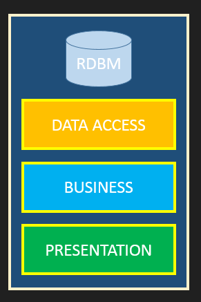

# BAM API

A GraphQL, "production ready"™ api for internal use at bam, but open sourced as an example !

## Foreword

Finding great ressources on the client side graphql is pretty easy, for instance, for apollo, there is https://www.learnapollo.com/.

Finding great ressources on the server side is way more difficult. GraphQL is only a spec and there is litterally at least 20 differents languages implementations for the backend.

That being said using the project as a boilerplate to start simple project with GraphQL may be less preagmatic than using great SASS, like https://www.graph.cool/ !

## Goals

The goals of this repo are:
- to have a graphql api that can be used as a reference for existing and new graphql projects,
- to have a graphql api that show some "production ready"™ tricks, that are not easy to find on the web (for instance oauth authentication and access control),
- to investigate the devlopment tooling around graphql apis (flow, eslint ect),
- to investigate good way to put containers on production (docker, maybe kubernetes ^^),
- to have a centralized api to start cool project at bam, like internal tools and so !

Non goals of this repo are:
- to be minimalist, (if you want that, use a sass, like graphcool)
- to be a boilerplate generator for the forseable future (that being said, we might extract our `create-graphql-api` app from this later on)

## Repository stucture

We organized the sever using the following layers:



### Database

All the file related are either:
- the `knexfile.js` at the root of the directory, used for knex command line
- in the `db` folder

The database layer are the `db/migrations/*.js` and `db/seed/*.js` files. Migrations are common for traditional RDBMs.

I'm personnaly found of them : I think they offer a extra security by providing incremental, reversible and documented changes.

We use the http://knexjs.org/ query builder to write and execute the migrations. Knex also provides a way to seed the devlopment with some fixtures data.

Last but not least, not using a full ORM make it actually easier to write performant and understandable database queries.

###  Query Builders

We then have Query Builders in the `db/queryBuilders` directory.

Query builders provide a domain driven abstraction to raw sql calls.

Considering the following example:

```js
class UserQueryBuilder {
  async createOrUpdateNameByID(id: string, name: string): UserType {
    const result = await knex.table('users').first('id', 'name').where('id', id);
    if (result) {
      return await knex.table('users').update('name', name).where('id', id).returning('id', 'name');
    }
    return await knex.table('users').insert({name}).returning('id', 'name');
  }
}
```

In the rest of the code we will use `UserQueryBuilder.createOrUpdateNameByID('long-uuid', 'Tom')`, which is a nice abstraction.

That being said we still have a great granularity about the real SQL query send, and we are able to use feature specifics like `returning` in our case, or index.

### Business logic

Above the query building layer, we have the business layer : `business/*.js`.

Basically the query building layer was "how can I access the data" in a naive way without taking into account access control.
On the contrary, the buisness logic handle the following tasks:

- **access controll** : if the user requesting a data has no right to access it, return null or throw an error,
- **scoping / whitelisting** : some properties are private, and you do not want to give them. For example, you never want to return the hash of the users password. You may want have a scoping that vary based on user role, for instance allowing only you and your manager to see your performance results,
- **batching and catching** : in order to solve the N+1 problem, we can use batching and caching, with Facebook dataloader. Example: if you want query a list of user and for each, the books he have readen, you will and up doing at least one query for the list of user and one query for each user to get the list of book. Using datloader you will do two query, one for the list of user, and one for the agregated list of book.
- **computed properties** : for example, if you want to still maintain the deprecated `name` field and now you have the `firstName` and a `lastName` in database, you can compute the `name` properties in the business class.


### Presentation

GraphQL is advanced presentation layer. It gives more informations to the client than most of REST apis around, in a simpler way.

Once one query is received, graphql parse it match it to a type system. Then it call resolvers, than will call our business logic. Graphql then return a response with the same data structure than the query, but with data inside.

In the `presentation` folder, we can find modules that all match the following structure:
- `XXXX.type.gql` that describes the type and the documentation. It uses the [GraphQL schema language](https://wehavefaces.net/graphql-shorthand-notation-cheatsheet-17cd715861b6)
- `XXXX.schema.gql` that will be concatenated to create the root schema. Evry field in the `XXXX.schema.gql` is directly accessible on top of the tree.
- `XXXX.resolvers.js` that will be concatenated to create the resolvers map, that will call the business layer to resolve efficiently and with security layer the data.

### Transport

So far the transport layer is a simple koa2 server, using HTTP 1.1.

The SSL termination is ensured by a nginx proxy, see the docker-compose file.

The authentication is done using public key JWT (RS256), with a google ouath provider, on auth0. In the future, we may consider self hosted solution like

## Contributors

Thanks goes to these wonderful people ([emoji key](https://github.com/kentcdodds/all-contributors#emoji-key)):

<!-- ALL-CONTRIBUTORS-LIST:START - Do not remove or modify this section -->
| [<br /><sub>TychoTa</sub>](https://twitter.com/TychoTa)<br />[💬](#question-tychota "Answering Questions") [💻](https://github.com/bamlab/bam-api/commits?author=tychota "Code") [📖](https://github.com/bamlab/bam-api/commits?author=tychota "Documentation") [🚇](#infra-tychota "Infrastructure (Hosting, Build-Tools, etc)") [🔧](#tool-tychota "Tools") | [<br /><sub>Yann Leflour</sub>](http://bamlab.fr/)<br />[🐛](https://github.com/bamlab/bam-api/issues?q=author%3Ayleflour "Bug reports") [💻](https://github.com/bamlab/bam-api/commits?author=yleflour "Code") [💡](#example-yleflour "Examples") [🔌](#plugin-yleflour "Plugin/utility libraries") [👀](#review-yleflour "Reviewed Pull Requests") |
| :---: | :---: |
<!-- ALL-CONTRIBUTORS-LIST:END -->

This project follows the [all-contributors](https://github.com/kentcdodds/all-contributors) specification. Contributions of any kind welcome!

## Licence

MIT